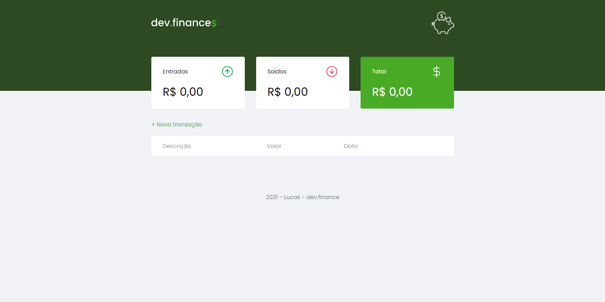

<h1 align="center">
    
</h1>

<br/>

## Tecnologias 🚀

* JavaScript
* HTML
* SASS
* Jquery
  
<br/>

## O projeto 💻

<p>
    O projeto tem como objetivo ser um controle financeiro,totalmente **front-end**, podendo ser excluido e adicionado transaçãoes,vendo o resultado total.
</p>

<br />

## Como Instalar ⚙️

1. Vá a uma pasta que queira utilizar o projeto
2. Abra o terminal de sua preferencia na pasta
3. Utilize o comando  ``` git clone https://github.com/hash-luk/Dev-Finance.git ```
4. Pronto !

<br />

## Como Utilizar ⌨️

1. Caso use o [visual estudio code](https://code.visualstudio.com/), certifique-se de ter instalado o [Live Server](https://marketplace.visualstudio.com/items?itemName=ritwickdey.LiveServer)
2. Abra o projeto no VSCode
3. No arquivo "index.html",clique com o direito e cliquem em "Abrir com Live Server"
4. Caso não possua o Live Server,abra o arquivo em um navegador padrão.

<br />

## Figma 📷

Acesse o layout através do [Figma.](https://www.figma.com/file/7Vu9DzUaCZIV4nibzkjgB4/dev.finance%24-Maratona-Discover?node-id=0%3A1)

<br />
<br />



<br />
<br />

## Licença

Esse projeto está sob a licença MIT. Veja o arquivo [LICENSE](LICENSE),para saber mais.

---

Desenvolvidor por [RocketSeat](https://rocketseat.com.br/),editado por [Lucas](https://github.com/hash-luk) ♥


